### terminator1333

Small tools for AI-assisted dev workflows.

---

## claude-listen

**Drop a meeting recording in. Get a speaker-labeled transcript and project-aware notes back.**

A [Claude Code](https://claude.ai/code) skill built on [faster-whisper](https://github.com/SYSTRAN/faster-whisper) and [pyannote.audio](https://github.com/pyannote/pyannote-audio). All local, no extra API calls. Notes written in the vocabulary of whichever project you're in.

```
/listen ~/recordings/standup.m4a extract action items and decisions
```



→ **[terminator1333/claude-listen](https://github.com/terminator1333/claude-listen)**

---

ICLR 2026 co-author — LLM safety via activation monitoring.
